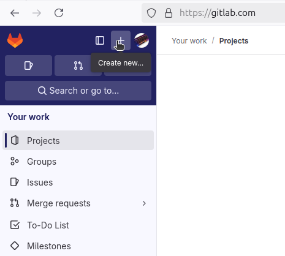
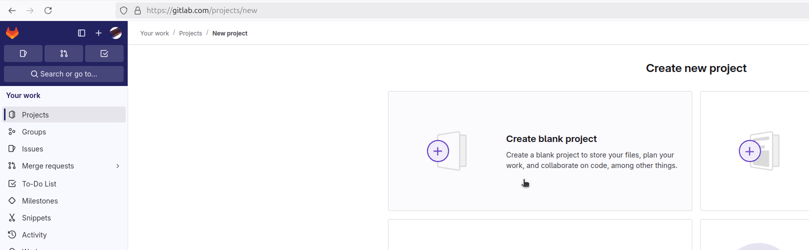
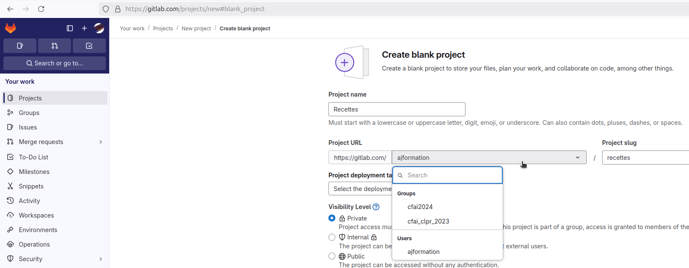
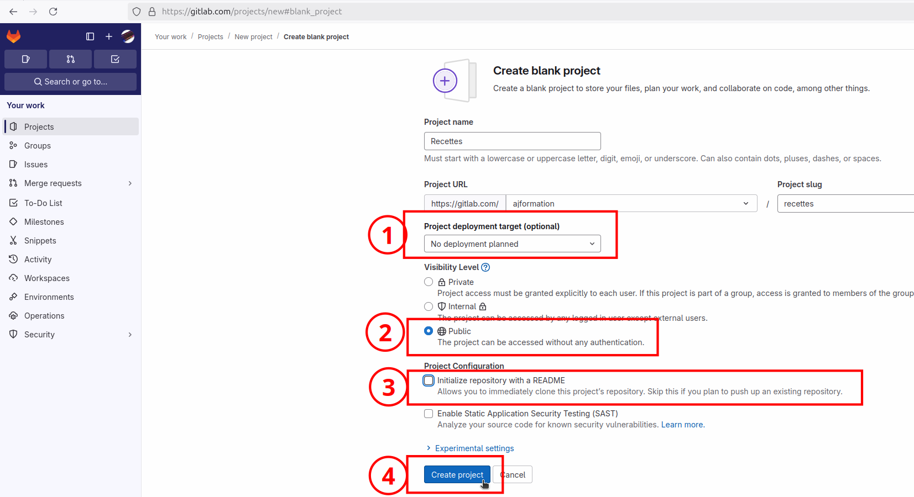
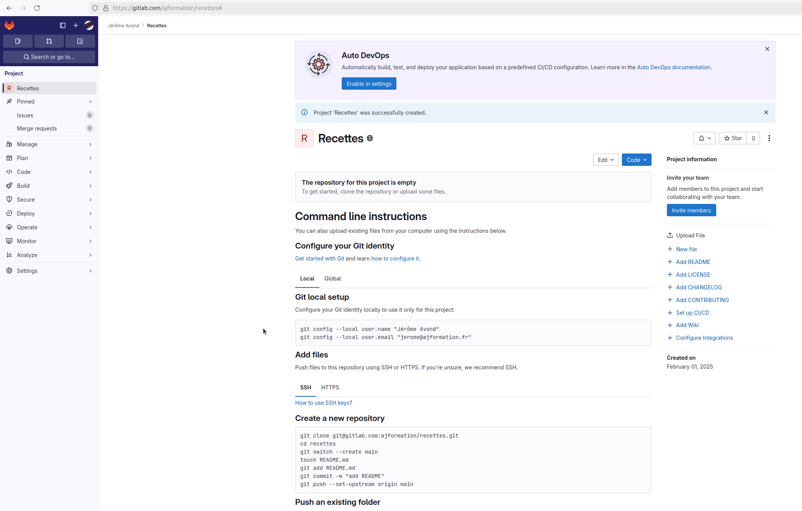
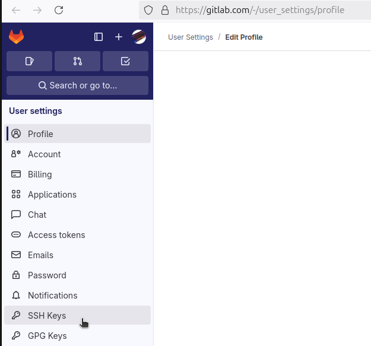
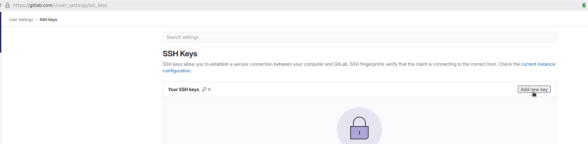
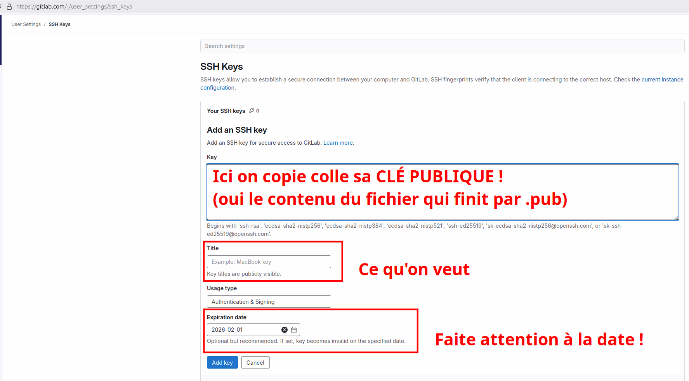
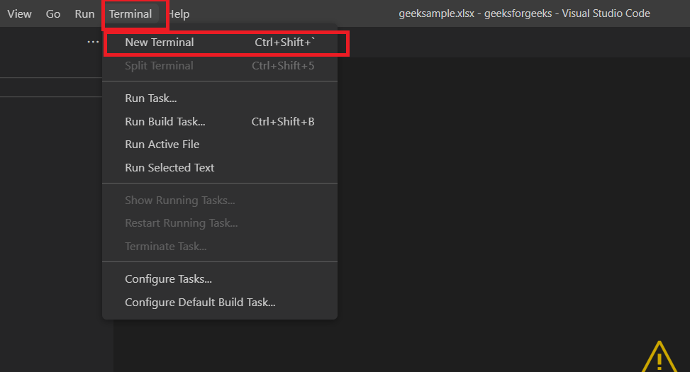
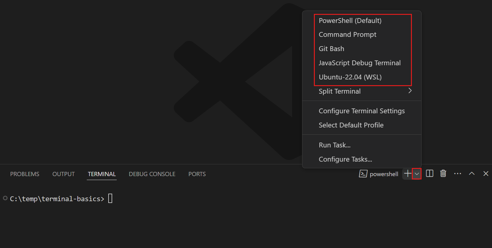

# Prérequis

## Compte et repo

Créer un compte sur (au choix) :

- <https://github.com/> : Le leader mondial (87% pdm est.)
- <https://gitlab.com/> : Le challenger (15% pdm est.)
- <https://bitbucket.org/> : La référence Atlassian
- <https://www.codebasehq.com/> : Une alternative
- <https://launchpad.net/> : La base de code des produits ubuntu
- <https://azure.microsoft.com/en-us/products/devops/> : La référence pour le code hébergé pour azure
- <https://framagit.org/> : Une alternative associative.

Sur ce howto on va se baser sur Gitlab, toutes ces alternatives sont compatibles avec ce qu'on va voir.

## Créer un premier projet

Sur gitlab, une fois connecté :

- On clic sur **"+"**



- Puis sur **"New project/repository"**


- Puis enfin sur **"Create blank project"**



- On ajoute un nom à ce projet
- On choisi "l'espace" (ici notre utilisateur)

> *On verra peut être plus tard l'intérêt de créer des groupes*



- On fait les derniers réglages



- On se retrouve sur la page du projet



## Initialisation de votre compte

Comme indiqué dans votre projet :


Créez une clé ssh (ou plus simple utilisez celle que vous avez déjà)

Et dans votre compte gitlab allez l'ajouter :








On vient de finir la partie préparation.

## Installer GIT

### Linux

```shell
. /etc/os-release
case $ID_LIKE in "debian") sudo apt install git ;; *"rehl"*|*"fedora"*) sudo dnf install git ;;  "*") echo 'get over it!' ;; esac
```

### Windows

- GitBash : <https://git-scm.com/downloads/win>
- Windows terminal : <https://apps.microsoft.com/detail/9n0dx20hk701?hl=fr-FR&gl=FR>

Mon conseil : Installer **vscode** et **gitbash** et de lancer un terminal dans vscode.



Puis de selectionner un terminal gitbash



[Utiliser Git](./2_utiliser_git.md)
