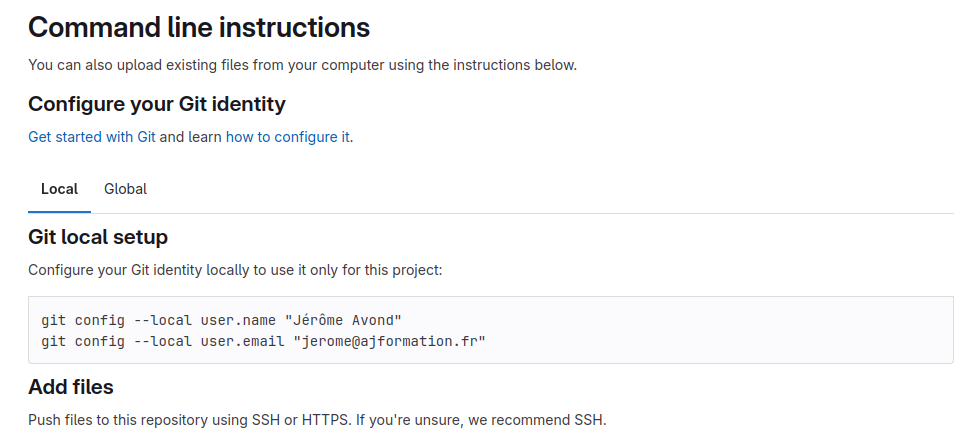
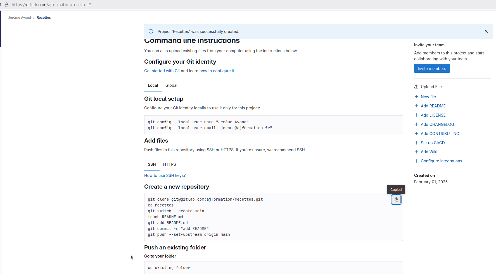
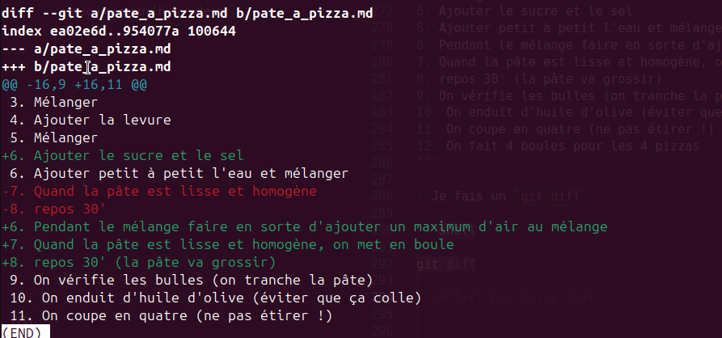
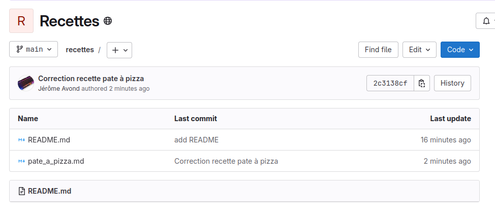

# Utiliser Git

## Préparation du compte sur votre poste

Comme indiqué dans votre projet :



```shell
git config --global user.name "Jérôme Avond"
git config --global user.email "jerome@ajformation.fr"
```

> **Ici je remplace par *local* par *global* pour ne pas avoir à préciser lors d'un prochain projet (c'est global à l'utilisateur du poste client)**

## récupérer un dossier sur un repo et travailler dessus

- Créez un dossier qui contiendra votre dossier (ou vos dossiers)
- Déplacez vous dedans en console
- Et taper les commandes indiquées dans votre projet :

```shell
git clone git@gitlab.com:ajformation/recettes.git
cd recettes
git switch --create main
touch README.md
git add README.md
git commit -m "add README"
git push --set-upstream origin main
```



Décorticons ces commandes

- `git clone git@gitlab.com:ajformation/recettes.git`
  - Ici on "clone" le répertoire, on demande à git de copier le dossier "recette" dans le dossier dans lequel nous sommes.
- `cd recettes`
  - On entre dans le dossier cloné
  - On peut vérifier, le dossier ne contient rien sinon un dossier `.git/`
- `git switch --create main`
  - On crée une première branche : la branche main
  - Ce sera notre "branche par défaut", celle sur laquelle on arrive par défaut
  - Nous reviendrons plus en détail sur le concept de "branche"
- `touch README.md`
  - On crée un fichier `README.md` vide
- `git add README.md`
  - Ici on vient ajouter ce nouveau fichier au futur `commit` que l'on va créer
  - On dit qu'on `stage` le fichier
  - à ce stade on peut `unstage` le fichier : `git restore --staged README.md`
- `git commit -m "add README"`
  - Ici on **crée** le commit
    - Il est automatiquement "signé" le commit,
    - Il est automatiquement rendu unique (empreinte SHA)
    - et il est automatiquement "chainé" avec les autres commits du projet (ici c'est le premier de la chaine)
    - La partie `-m "add README"` **nomme** le commit
      - L'identifiant unique du commit est son empreinte SHA
      - Le nommage peut être sur plusieurs lignes (c'est plus une description)
      - Le **gitflow** de l'équipe avec laquelle ou travail sur le projet normalise la façon de nommer les commits
      - C'est une normalisation importante pour faciliter l'échange et le travail avec l'équipe
  - Le commit est un "ensemble de modifications réalisées sur le dossier"
    - Ajout/suppression de fichiers
    - Ajout/suppression de lignes dans un ou plusieurs fichiers
  - C'est un élément atomique du journal du projet git.
  - Le log (journal du projet) permet de voir l'évolution du projet
    - Chaque commit doit avoir une description suffisamment précise et efficace pour que l'équipe puisse comprendre l'intérêt de chaque `commit` (donc de chaque **modification** du projet)
  - Une fois le `commit` créé, il devient plus difficile de revenir en arrière (pas impossible, nous verons plus tard)
  - Il vaut mieux au début être relativement sûr de soi pour chaque `commit`
  - En cas de problème on corrige en faisant un nouveau `commit`
  - Il vaut mieux faire ainsi :
    - Ne `stager` QUE les fichiers dont on est sûr (éviter d'ajouter tout un dossier par exemple)
    - Bien vérifier ce qu'on va mettre dans un commit avec un `git status`
    - Finaliser avec un `git commit -m "Description..."`
    - Ne pas faire un `git commit` seul au début, ça ouvre un éditeur pour la description qui peut être destabilisant au début.
- `git push --set-upstream origin main`
  - Ici on pousse le commit sur le répo distant ET on définit la branche `upstream` de la branche locale (qui s'appelera également `main`)
  - Cette commande est à réaliser pour pousser le premier commit
  - Ensuite, comme la branche locale `main` est **connecté** à la branche distante `main`, on se contentera de taper `git push`

## Ajout d'une première recette

- Créez le fichier "pate_a_pizza.md"
- Remplir avec ce texte

```markdown
# Pâte à pizza

## ingrédients

- 1kg de farine (13% protéines)
- 700ml d'eau
- 15g d'huile d'olive
- 10g de sel
- 5g de sucre
- 1 sachet de levure de boulanger

## recette

1. Faire un puit avec la farine
2. Ajouter 200 ml d'eau
3. Mélanger
4. Ajouter la levure
5. Mélanger
6. Ajouter petit à petit l'eau et mélanger
7. Quand la pâte est lisse et homogène
8. repos 30'
9. On vérifie les bulles (on tranche la pâte)
10. On enduit d'huile d'olive (éviter que ça colle)
11. On coupe en quatre (ne pas étirer !)
12. On fait 4 boules pour les 4 pizzas
```

- On lance les commandes

```shell
$ git add pate_a_pizza.md

$ git status
Sur la branche main
Votre branche est à jour avec 'origin/main'.

Modifications qui seront validées :
  (utilisez "git restore --staged <fichier>..." pour désindexer)
    nouveau fichier : pate_a_pizza.md


$ git commit -m "Ajout recette pate à pizza"
[main 87e0b51] Ajout recette pate à pizza
 1 file changed, 25 insertions(+)
 create mode 100644 pate_a_pizza.md

$ git status                                
Sur la branche main
Votre branche est en avance sur 'origin/main' de 1 commit.
  (utilisez "git push" pour publier vos commits locaux)

rien à valider, la copie de travail est propre

$ git push
Énumération des objets: 4, fait.
Décompte des objets: 100% (4/4), fait.
Compression par delta en utilisant jusqu'à 8 fils d'exécution
Compression des objets: 100% (3/3), fait.
Écriture des objets: 100% (3/3), 646 octets | 646.00 Kio/s, fait.
Total 3 (delta 0), réutilisés 0 (delta 0), réutilisés du pack 0
To https://gitlab.com/ajformation/recettes.git
   55067aa..87e0b51  main -> main

```

On va voir sur le site web de gitlab le résultat

## Corrections

- J'ai oublié d'ajouter le sel et le sucre
- J'ai oublié de préciser l'ajout d'un maximum d'air lors du mélange

Je fais les modifications

```markdown
# Pâte à pizza

## ingrédients

- 1kg de farine (13% protéines)
- 700ml d'eau
- 15g d'huile d'olive
- 10g de sel
- 5g de sucre
- 1 sachet de levure de boulanger

## recette

1. Faire un puit avec la farine
2. Ajouter 200 ml d'eau
3. Mélanger
4. Ajouter la levure
5. Mélanger
6. Ajouter le sucre et le sel
6. Ajouter petit à petit l'eau et mélanger
6. Pendant le mélange faire en sorte d'ajouter un maximum d'air au mélange
7. Quand la pâte est lisse et homogène, on met en boule
8. repos 30' (la pâte va grossir)
9. On vérifie les bulles (on tranche la pâte)
10. On enduit d'huile d'olive (éviter que ça colle)
11. On coupe en quatre (ne pas étirer !)
12. On fait 4 boules pour les 4 pizzas
```

- Je fais un `git diff`

```shell
git diff
```



```shell

$ git status
Sur la branche main
Votre branche est à jour avec 'origin/main'.

Modifications qui ne seront pas validées :
  (utilisez "git add <fichier>..." pour mettre à jour ce qui sera validé)
  (utilisez "git restore <fichier>..." pour annuler les modifications dans le répertoire de travail)
    modifié :         pate_a_pizza.md

$ git add pate_a_pizza.md 

$ git commit -m "Correction recette pate à pizza"
[main 2c3138c] Correction recette pate à pizza
 1 file changed, 4 insertions(+), 2 deletions(-)

$ git status 
Sur la branche main
Votre branche est en avance sur 'origin/main' de 1 commit.
  (utilisez "git push" pour publier vos commits locaux)

rien à valider, la copie de travail est propre

$ git push
Énumération des objets: 5, fait.
Décompte des objets: 100% (5/5), fait.
Compression par delta en utilisant jusqu'à 8 fils d'exécution
Compression des objets: 100% (3/3), fait.
Écriture des objets: 100% (3/3), 477 octets | 477.00 Kio/s, fait.
Total 3 (delta 1), réutilisés 0 (delta 0), réutilisés du pack 0
To https://gitlab.com/ajformation/recettes.git
   87e0b51..2c3138c  main -> main
```

On regarde le résultat sur le site web



Voilà pour cette première partie.

Créez autant de projets, ou ajouter autant de fichiers, jusqu'à ce que vous maîtrisiez ces commandes de base.

[Créer une branche](./3_créer_une_branche.md)
