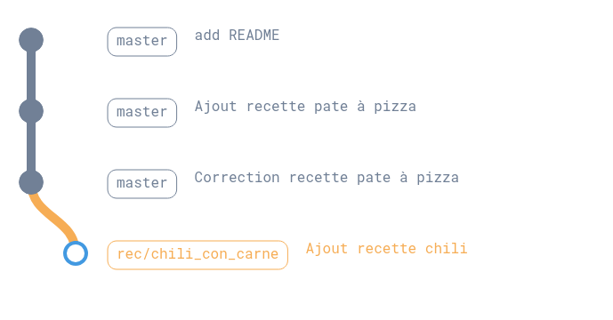
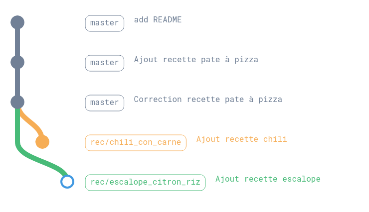
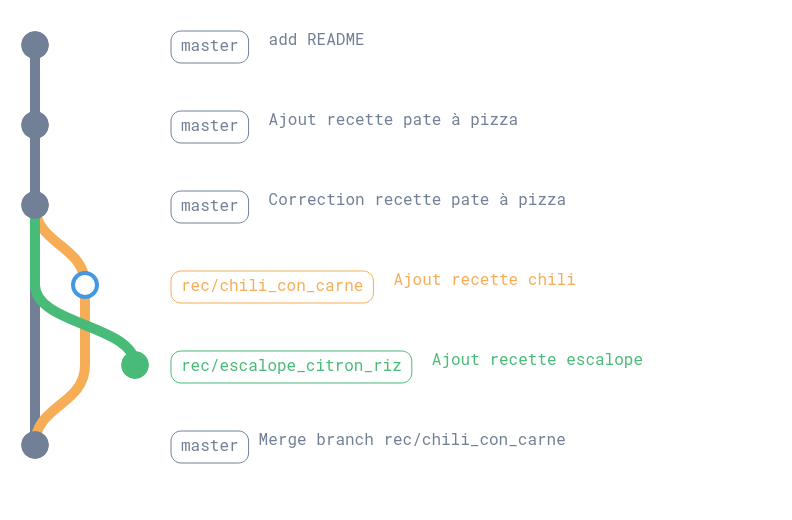
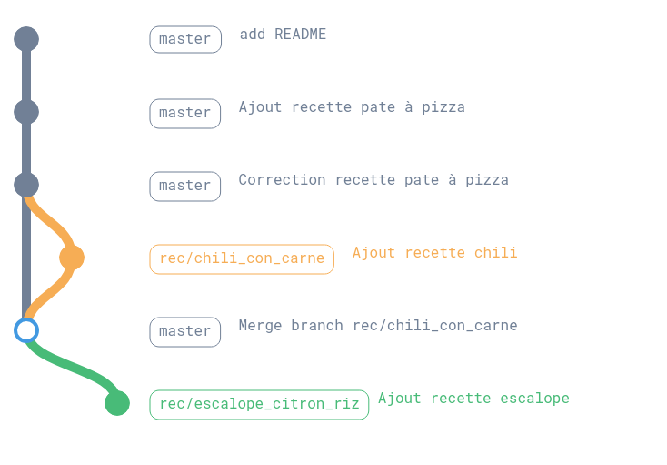

# Créer une branche

Dans notre dossier `recettes` :

```shell

$ tree ./
./
├── pate_a_pizza.md
└── README.md

1 directory, 2 files

$ git status 
Sur la branche main
Votre branche est à jour avec 'origin/main'.

rien à valider, la copie de travail est propre

$ git branch -v | cat
* main 2c3138c Correction recette pate à pizza

```

Pour faciliter la collaboration lors du travail sur un dossier, il vaut mieux travailler avec des branches.

- Chacun travail sur des améliorations/modifications dans un espace dédié basé sur une "version" de la branche "`main`"
- L'idéal est que chaque branche modifie des fichiers différents
- En cas de modifications sur un même fichier (voir pire sur les mêmes lignes)
  - On peut gérer plus facilement et sans perdre de données
- On dispose des "`merge request`" (ou `pull request`) qui permettent de "fusionner" les branches entre elles.

Le plus simple à ce stade est d'utiliser des schémas :

## Créer une nouvelle branche



```shell

$ git checkout main 
Déjà sur 'main'
Votre branche est à jour avec 'origin/main'.

$ git -P branch
*  main

$ git checkout -b rec/chili_con_carne
Basculement sur la nouvelle branche 'rec/chili_con_carne'

$ git -P branch
  main
* rec/chili_con_carne

```

- `git checkout main` : `checkout` permet de "passer" d'une branche à l'autre, ici on s'assure d'être bien sur la branche `main`
- `git checkout -b rec/chili_con_carne` : l'ajout de l'option `-b` (pas de version longue), permet de **créer** une nouvelle branche et de se déplacer dessus.
- `git -P branch` : `branch` permet de "visualiser" les branches disponibles en local
  - l'option `-P` permet simplement de ne pas avoir de *pager* (type less, more) et d'avoir le résultat directement dans la sortie standard.
  - `*` : l'astérisque permet d'indiquer sur quelle branche on se trouve

## Passer d'une branche à l'autre

Créons une nouvelle branche sur main



```shell

$ git checkout main 
Basculement sur la branche 'main'
Votre branche est à jour avec 'origin/main'.

$ git checkout rec/chili_con_carne 
Basculement sur la branche 'rec/chili_con_carne'

$ git checkout main                          
Basculement sur la branche 'main'
Votre branche est à jour avec 'origin/main'.

$ git -P branch -v
* main                    2c3138c Correction recette pate à pizza
  rec/chili_con_carne     2c3138c Correction recette pate à pizza
  rec/escalope_citron_riz 2c3138c Correction recette pate à pizza

$ git checkout rec/chili_con_carne 
Basculement sur la branche 'rec/chili_con_carne'

$ git -P branch -v                
  main                    2c3138c Correction recette pate à pizza
* rec/chili_con_carne     2c3138c Correction recette pate à pizza
  rec/escalope_citron_riz 2c3138c Correction recette pate à pizza

$ git checkout rec/escalope_citron_riz 
Basculement sur la branche 'rec/escalope_citron_riz'

$ git -P branch -v                    
  main                    2c3138c Correction recette pate à pizza
  rec/chili_con_carne     2c3138c Correction recette pate à pizza
* rec/escalope_citron_riz 2c3138c Correction recette pate à pizza

```

- `-v` : Option `--verbose` permet d'indiquer le `commit` sur lequel est défini la branche

> ATTENTION : les schémas montrent un commit sur les nouvelles branches qui n'existe pas encore.

## Ajouter un commit sur une branche

```shell

$ git -P branch -v  
* main                    2c3138c Correction recette pate à pizza
  rec/chili_con_carne     2c3138c Correction recette pate à pizza
  rec/escalope_citron_riz 2c3138c Correction recette pate à pizza

$ git checkout rec/chili_con_carne 
Basculement sur la branche 'rec/chili_con_carne'

$ vim chili_con_carne.md

$ git add chili_con_carne.md 

$ git commit -m "Ajout recette chili"            
[rec/chili_con_carne f292a2d] Ajout recette chili
 1 file changed, 24 insertions(+)
 create mode 100644 chili_con_carne.md

$ git status
Sur la branche rec/chili_con_carne
rien à valider, la copie de travail est propre

```

## Merger une branche dans main

```shell
$ git -P branch -v
  main                    2c3138c Correction recette pate à pizza
* rec/chili_con_carne     f292a2d Ajout recette chili
  rec/escalope_citron_riz 2c3138c Correction recette pate à pizza

$ git checkout main               
Basculement sur la branche 'main'
Votre branche est à jour avec 'origin/main'.

$ git merge rec/chili_con_carne 
Mise à jour 2c3138c..f292a2d
Fast-forward
 chili_con_carne.md | 24 ++++++++++++++++++++++++
 1 file changed, 24 insertions(+)
 create mode 100644 chili_con_carne.md

$ git -P branch -v             
* main                    f292a2d [en avance de 1] Ajout recette chili
  rec/chili_con_carne     f292a2d Ajout recette chili
  rec/escalope_citron_riz 2c3138c Correction recette pate à pizza

```

> La mention "`en avance de 1`" doit se comprendre par rapport à la branche `remote` sur le repo gitlab.



## Rebaser une branche

```shell

$ git -P branch -v
* main                    f292a2d [en avance de 1] Ajout recette chili
  rec/chili_con_carne     f292a2d Ajout recette chili
  rec/escalope_citron_riz 2c3138c Correction recette pate à pizza

$ git checkout rec/escalope_citron_riz 
Basculement sur la branche 'rec/escalope_citron_riz'

$ git rebase main 
Rebasage et mise à jour de refs/heads/rec/escalope_citron_riz avec succès.

```



On récupère les modifications que la branche `main` a subit.

Ainsi on aura pas de croisements,

et si jamais certains fichiers ont été modifiés par 2 branches,

On dispose d'un cadre (le rabasage) pour arbitrer les modifications à conserver.
